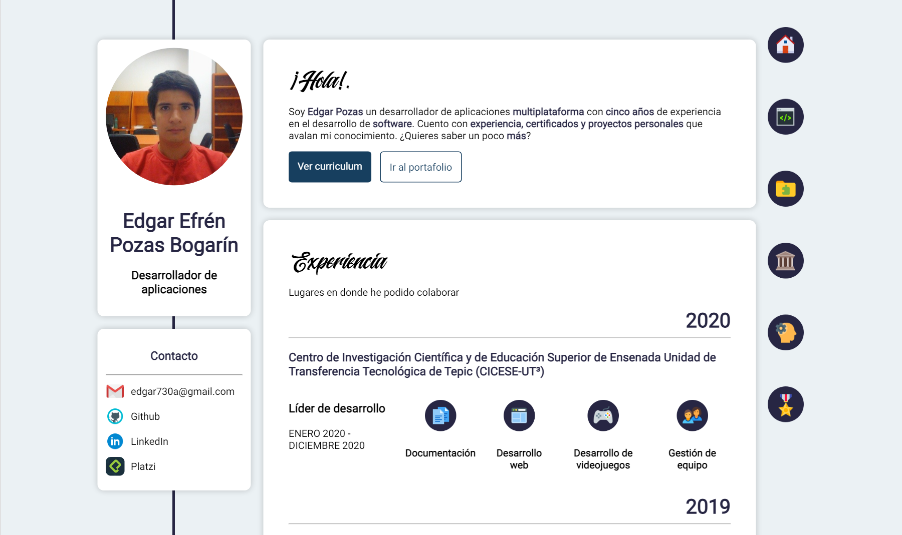
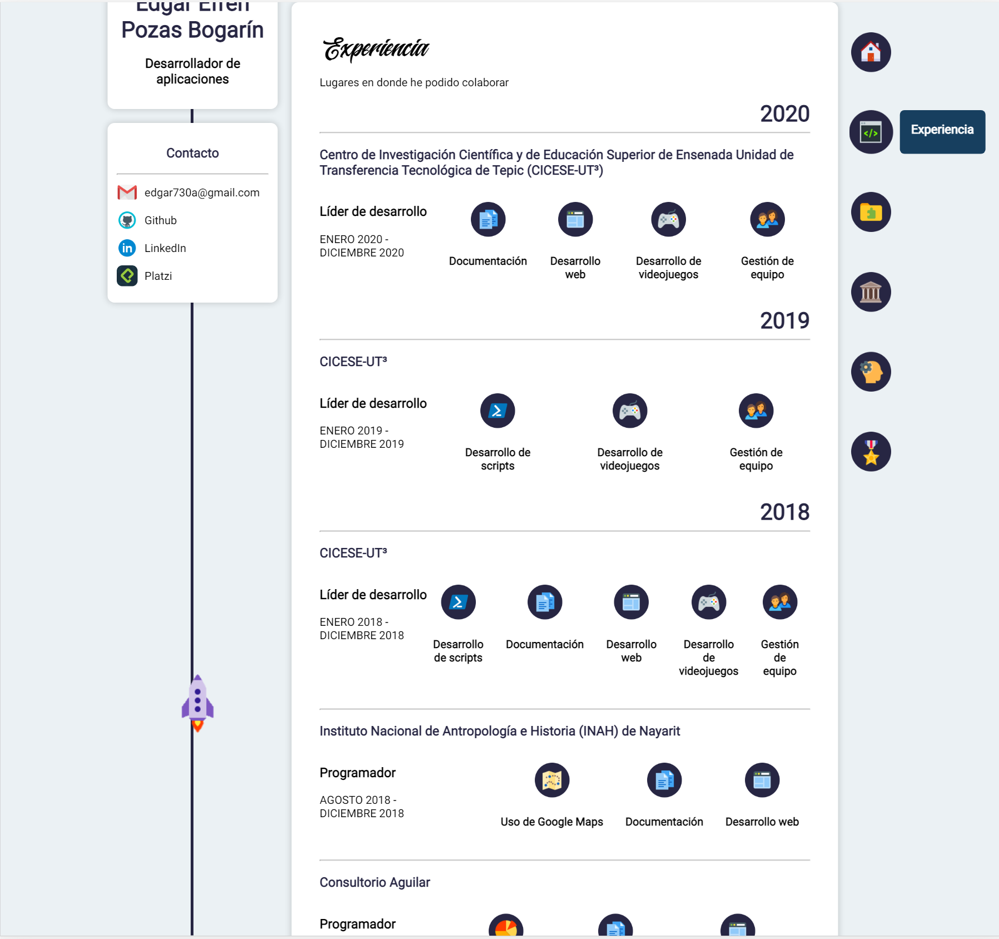
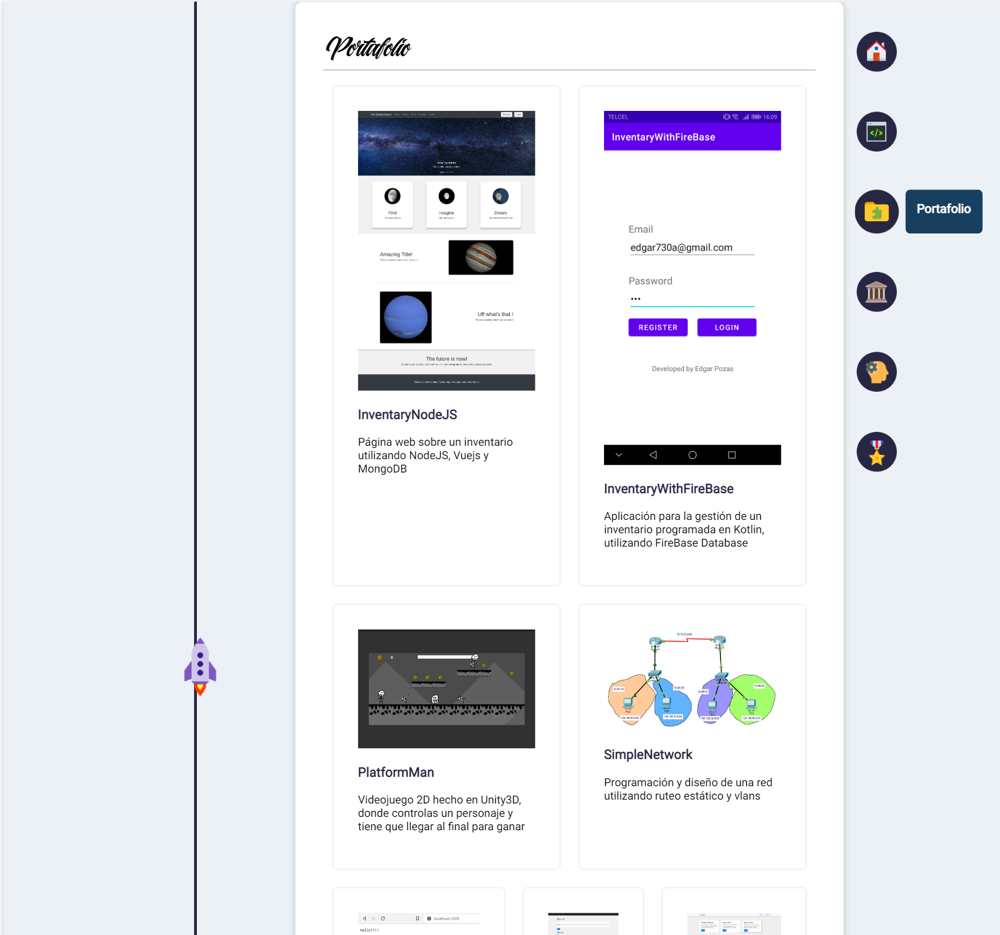
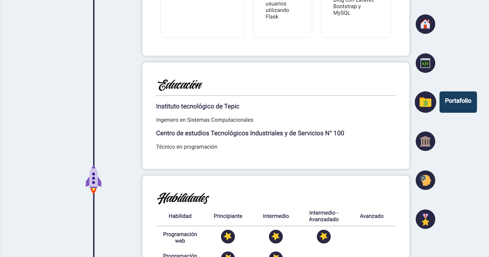
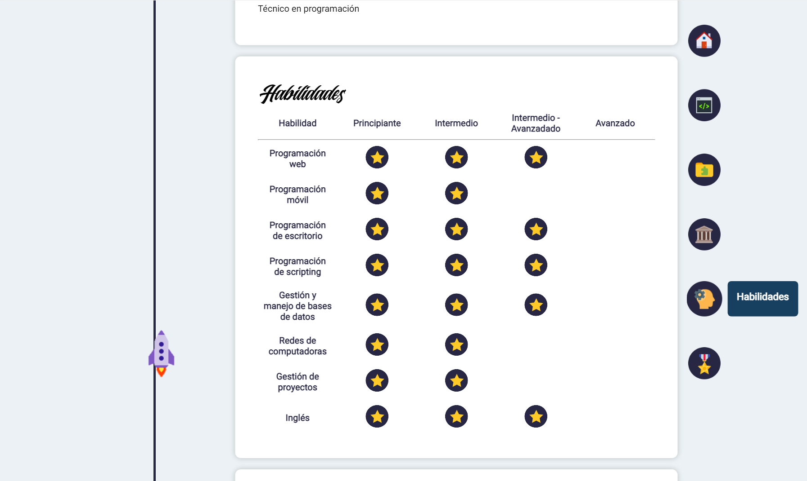
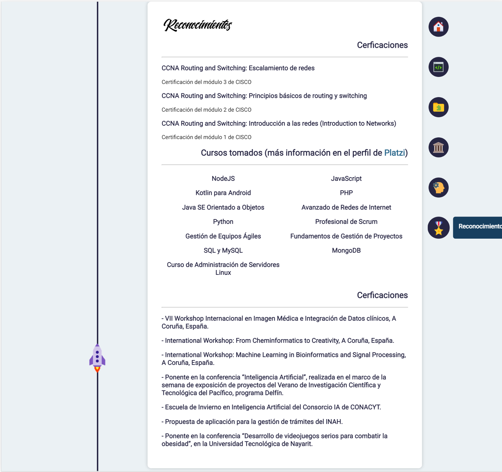
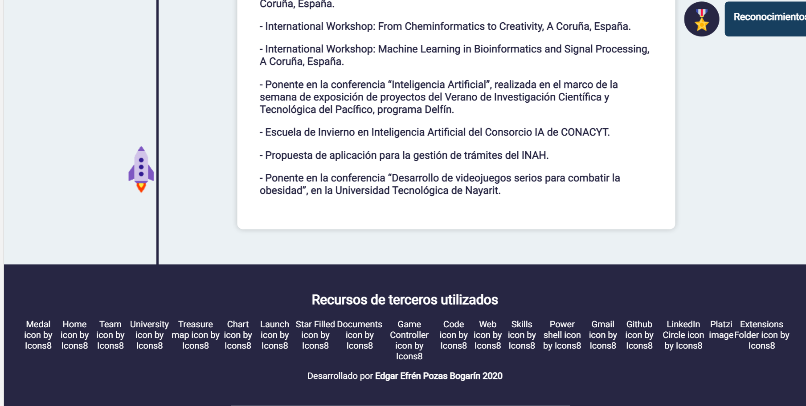

# MyPage

This is web version of my CV

## Requirements

Just enjoy!

## Installation

First download or clone the repository. Next to place inside the folder.

## Run

In order to see the page, you can access openning the "index.html" file and then see in the browser or you can access in the next link

```
https://edgarpozas.github.io/MyPage/index.html
```

## Views
Home


Experience


Portfolio


Education


Skills


Awards


Thanks

